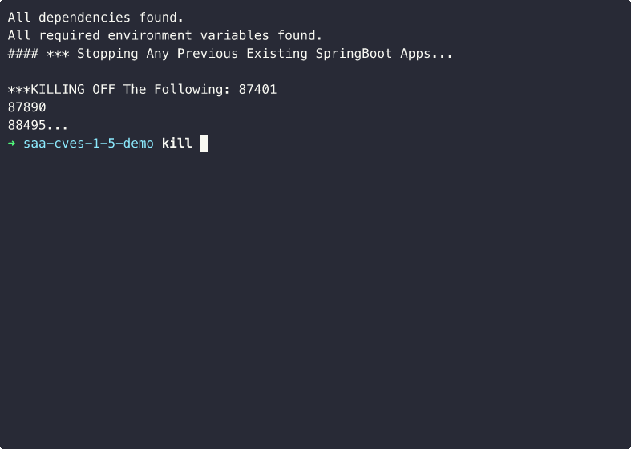

[![Forks][forks-shield]][forks-url]
[![Stargazers][stars-shield]][stars-url]
[![Issues][issues-shield]][issues-url]



# Spring Application Advisor Upgrade Example

## Description

This interactive demo showcases the power of Spring Application Advisor (SAA) by automatically upgrading a Spring Boot application from version 1.5.0 to 4.0. The demo provides a comprehensive comparison of improvements achieved through modern Spring Boot versions and Java runtime upgrades.

### What the Demo Does

1. **Environment Setup**: Automatically configures Java 8 and Java 21 environments using SDKMAN
2. **Baseline Measurement**: Clones and runs a Spring Boot 1.5.0 application with Java 8, measuring:
   - Startup time
   - Memory usage
   - Known CVEs (via OWASP Dependency Check, run in the background during app startup/stop)
3. **Application Analysis**: Uses Spring Application Advisor to analyze the existing application, capturing:
   - Build configuration metadata
   - Software Bill of Materials (SBOM) with component/dependency inventory
   - Git repository information
   - Tool versions
4. **Automated Upgrade**: Generates and applies an upgrade plan that transforms the application to Spring Boot 4.0
5. **Post-Upgrade Analysis**: Runs `advisor build-config get` again after the upgrade to capture the updated SBOM
6. **Performance Validation**: Runs the upgraded application with Java 21 and measures the same metrics
7. **Results Comparison**: Displays a side-by-side table showing:
   - Startup time (with % improvement)
   - Dependency count (from SBOM)
   - Known CVE count
   - Memory usage
   - Memory savings (%)

### Key Benefits Demonstrated

- **Zero Manual Effort**: Complete upgrade from Spring Boot 1.5 → 4.0 with no manual code changes
- **Performance Gains**: Typically shows significant improvements in startup speed and memory efficiency
- **Security Posture**: Demonstrates CVE reduction achieved by upgrading to a modern, supported version
- **Dependency Insight**: SBOM comparison shows how the dependency footprint changes after upgrade
- **Modern Java Features**: Leverages Java 21 optimizations and Spring Boot 4.x enhancements

The demo is designed for live presentations and includes interactive pauses, colored output, and timing measurements to create an engaging experience.

## Prerequisites

- [Spring Application Advisor](https://enterprise.spring.io/spring-application-advisor)
  > Spring Enterprise Repository Access required
- [SDKMan](https://sdkman.io/install)
  > i.e. `curl -s "https://get.sdkman.io" | bash`
- [Httpie](https://httpie.io/) needs to be in the path
  > i.e. `brew install httpie`
- [jq](https://jqlang.github.io/jq/) needs to be in the path
  > i.e. `brew install jq`
- bc, pv, zip, unzip, gcc, zlib1g-dev
  > i.e. `sudo apt install bc pv zip unzip gcc zlib1g-dev -y`
- [Vendir](https://carvel.dev/vendir/)
  > i.e. `brew tap carvel-dev/carvel && brew install vendir`

## Required Environment Variables

The OWASP Dependency Check requires the following environment variables to be set before running the demo:

```bash
export NVD_API_KEY=<your-nvd-api-key>
export OSSINDEX_USERNAME=<your-ossindex-username>
export OSSINDEX_PASSWORD=<your-ossindex-password>
```

- **NVD_API_KEY**: API key for the [National Vulnerability Database](https://nvd.nist.gov/developers/request-an-api-key)
- **OSSINDEX_USERNAME** / **OSSINDEX_PASSWORD**: Credentials for [Sonatype OSS Index](https://ossindex.sonatype.org/)

## Quick Start

```bash
./demo.sh
```

## Attributions
- [Demo Magic](https://github.com/paxtonhare/demo-magic) is pulled via `vendir sync` (skipped if already present)

## Related Videos

- https://www.youtube.com/live/qQAXXwkaveM?si=4KunXZaretBrPZs3
- https://www.youtube.com/live/ck4AP7kRQkc?si=lDl203vbfZysrX5e
- https://www.youtube.com/live/VWPrYcyjG8Q?si=z7Q2Rm_XOlBwCiei

<!-- MARKDOWN LINKS & IMAGES -->
<!-- https://www.markdownguide.org/basic-syntax/#reference-style-links -->
[forks-shield]: https://img.shields.io/github/forks/dashaun-tanzu/saa-hello-world-1-5-demo.svg?style=for-the-badge
[forks-url]: https://github.com/dashaun-tanzu/saa-hello-world-1-5-demo/forks
[stars-shield]: https://img.shields.io/github/stars/dashaun-tanzu/saa-hello-world-1-5-demo.svg?style=for-the-badge
[stars-url]: https://github.com/dashaun-tanzu/saa-hello-world-1-5-demo/stargazers
[issues-shield]: https://img.shields.io/github/issues/dashaun-tanzu/saa-hello-world-1-5-demo.svg?style=for-the-badge
[issues-url]: https://github.com/dashaun-tanzu/saa-hello-world-1-5-demo/issues
